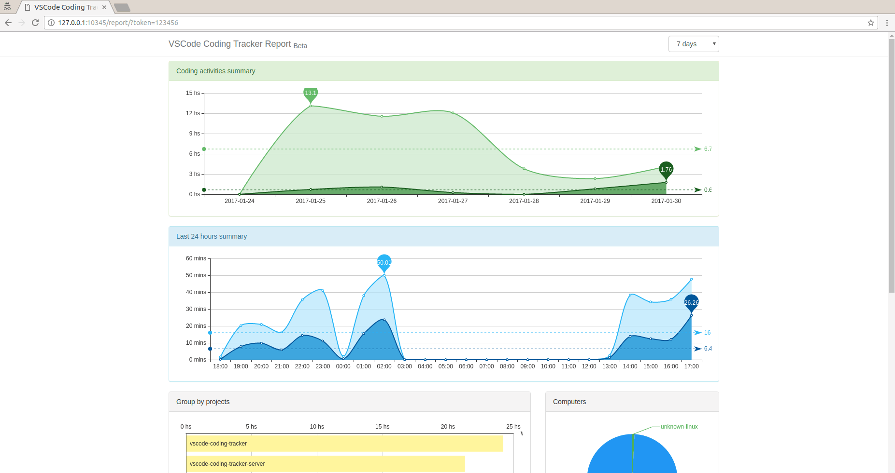

# Visual Studio Code Coding Tracker Server

VSCode Coding Tracker extension server side program. 
> See more:   
> VSCode Coding Tracker extension   
> [GitHub repo](https://github.com/hangxingliu/vscode-coding-tracker)   
> [VSCode Extensions Marketplace](https://marketplace.visualstudio.com/items?itemName=hangxingliu.vscode-coding-tracker)
> 
> ---
> That repository be separate from above extension repository.
> So you could find more older commit information in that repository. 

## Screenshot

## How To Install And Use

1. Make sure You have installed `Node.js` development environment included `npm`
2. Install this server program
	- Way 1 : Clone this repository and execute **`npm i`** in the folder where this README.md located 
	- Way 2 : Using **`npm i vscode-coding-tracker-server`** anywhere you want to install to
3. Execute **`npm start`** or **`node app`** to launch this server program. 
	- You could give it more options like **`npm start -- ${MORE_SERVER_OPTIONS}`** if you start it by using `npm start`
4. Open URL `http://domain:port/report?token=${YOUR_TOKEN}` to get coding report
	- In default, URL in local is `http://127.0.0.1:10345/report?token=${YOUR_TOKEN}`
	- If you using `--public-report` option to launch server, you could ignore the query parameter `token` in above URL

> More server option things:
>
> `--local`: It means server bind address on `127.0.0.1` when server listening.
> **(Other computer could not upload data and visit report page in this mode)**
>
> `--random-port`: It means server will using a 8 length random string as API/upload token
>  **even if you giving a token by `-t` option**
>
> `--public-report`: It means anyone could visit report page without token
> 
> **more options information you could find by using command `node app --help`**

## Current Version

## 0.4.0

0. full projects and languages report
0. i18n support (English, Chinese)(And waiting for your translation)
1. optimized chart and tooltip of chart display
2. optimized the frontend codes and replaced frontend builder
3. optimized request error display

more version information: [CHANGELOG.md](CHANGELOG.md)

## File List

redirect to [FILES.md](FILES.md)

## Author

[LiuYue](https://github.com/hangxingliu)

## License

[GPL-3.0](LICENSE)