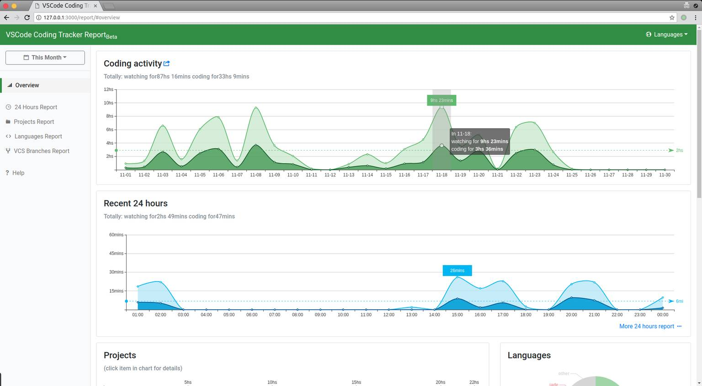

# Visual Studio Code Coding Tracker Server

VSCode Coding Tracker extension server side program.    

> Links:  
> [Extension side Github repo](https://github.com/hangxingliu/vscode-coding-tracker)   
> [VSCode extensions marketplace](https://marketplace.visualstudio.com/items?itemName=hangxingliu.vscode-coding-tracker)   
>
> Give me coffee for coding better via [Paypal](https://www.paypal.me/hangxingliu)   
> *Your support encourage me to make my vscode extensions better and better! (and add more and more features)*

## Screenshot

## Current Version

### 0.7.0 (2018/05/xx) **Coding...**

0. Support token files to declare multi-tokens
	- [x] basic support
	- [x] support computerId attributes for uploadToken
	- [x] more unit tests
	- [x] more and more unit tests
1. More filter rules are supported.
	- [ ] backend support
	- [ ] frontend support
		- [ ] start new front-end deveploment (replace pug to [preact jsx](https://preactjs.com/))
2. Refactory I18N support placeholder to more readable (**maybe delay**)
3. Merge file path and project path better.
	- [x] unit test for report-v2
	- [x] depends on file **reader with cache** and **pre-scan for finding projects**
4. Optimize database reader (add cache for old files)
	- [x] new intermediate layer for filesystem reading operation
	- [x] add cache for old files by following modify time
	- [x] add this layer into AnalyzeCore
	- [x] unit tests

### 0.6.0 (2018/03/23)

0. Support exporting/downloading report data as CSV format.
1. Support adding association for projects (So you can merge report from different projects).
2. Fix incorrect 24 hours report.
3. Fix some wrong i18n on the UI.
4. More compatible with old browsers and mobile browsers.

## How To Install And Use

1. Make sure You have installed `Node.js` development environment included `npm`
2. Install this server program
	- Way 1 : Clone this repository and execute **`npm i`** in the folder where this README.md located 
	- Way 2 : Using **`npm i vscode-coding-tracker-server`** anywhere you want to install to
3. Execute **`npm start`** or **`node app`** to launch this server program. 
	- You could give it more options like **`npm start -- ${MORE_SERVER_OPTIONS}`** if you start it by using `npm start`
4. Open URL `http://domain:port/report?token=${YOUR_TOKEN}` to get coding report
	- In default, URL in local is `http://127.0.0.1:10345/report?token=${YOUR_TOKEN}`
	- If you using `--public-report` option to launch server, you could ignore the query parameter `token` in above URL

> More server option things:
>
> `--local`: It means server bind address on `127.0.0.1` when server listening.
> **(Other computer could not upload data and visit report page in this mode)**
>
> `--random-token`: It means server will using a 8 length random string as API/upload token
>  **even if you giving a token by `-t` option**
>
> `--public-report`: It means anyone could visit report page without token
> 
> **more options information you could find by using command `node app --help`**

more version information: [CHANGELOG.md](CHANGELOG.md)

## Contributing

It is **necessary** to read [CONTRIBUTING.md](CONTRIBUTING.md) before **contributing codes/translations or building codes**

### Editing/Modifying/Buidling codes

Goto chapter *Editing, Building, Running and Testing* in [CONTRIBUTING.md](CONTRIBUTING.md).

### Files manifest

redirect to [FILES.md](docs/FILES.md)

## Author

[LiuYue](https://github.com/hangxingliu)

## Contributors

[Dolgishev Viktor (@vdolgishev)][vdolgishev]

## License

[GPL-3.0](LICENSE)

[vdolgishev]: https://github.com/vdolgishev
